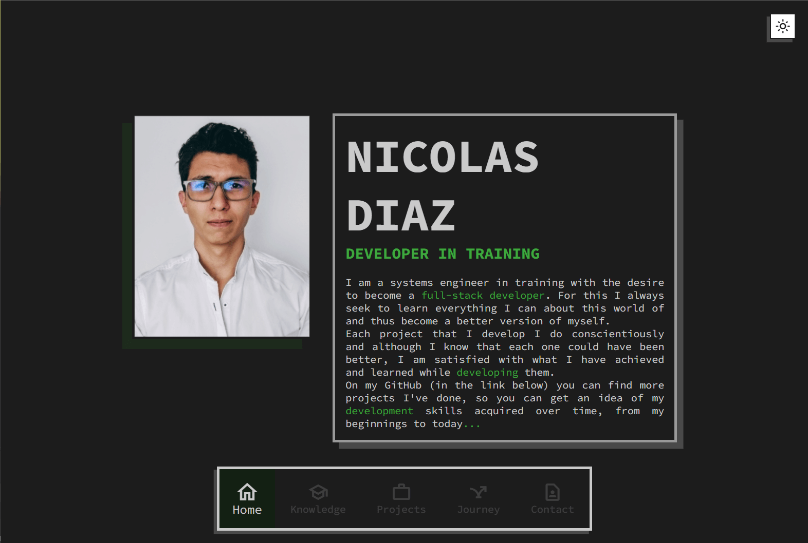

# portfolio

## Table of contents

- [Overview](#overview)
  - [The challenge](#the-challenge)
  - [Screenshot](#screenshot)
  - [Links](#links)
- [My process](#my-process)
  - [Built with](#built-with)
- [Author](#author)
- [Acknowledgments](#acknowledgments)

## Overview

### The challenge

Users should be able to:

- See my information the technologies that I have basic management, my projects, my career and contact information.
- View the optimal layout depending on their device's screen size
- See hover states for interactive elements

### Screenshot

### Links

- Live Site URL: [Live Site](https://github.com/nicolas1102/nicolas-portfolio)

## My process

### Built with

- HTML5 
- CSS
- JS

## Author

- Website - [Nicolas Diaz](https://nicolas1102.github.io/portfolio/)
- Linkedin - [Nicolas Diaz](www.linkedin.com/in/nicolas-diaz-vargas)
- Instagram - [@nicolasdiaz_1102](https://www.instagram.com/nicolasdiaz_1102/?theme=dark)
